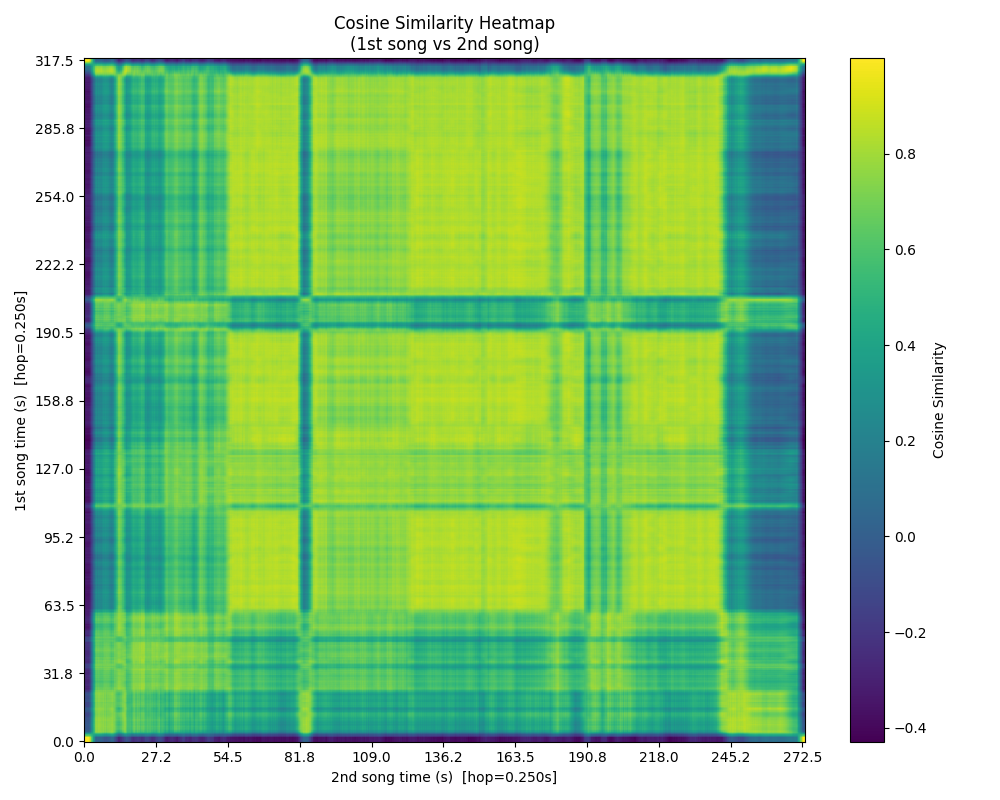
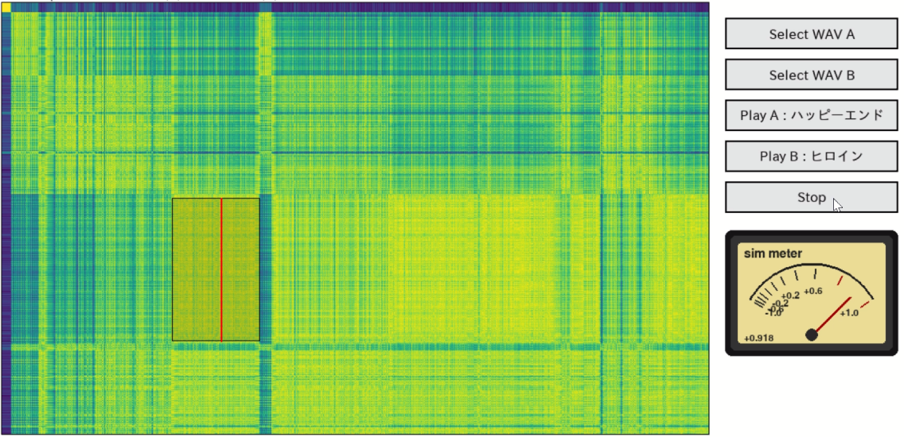

# 複数楽曲間の類似要素の把握に向けた楽曲間時系列類似度マップの作成

本リポジトリは、学士研究として開発した楽曲類似度可視化システムのソースコードです。

<p align="center">
  
</p>

楽曲から抽出した音響特徴量を用いてフレーム単位の埋め込み表現を学習し、楽曲間の類似度を時系列上で可視化することで、複数楽曲に存在する類似部分の把握を支援します。
類似度マップの黄色くなっている領域が類似している、青くなっている領域が類似していないことを示している。

---

## 研究背景

音楽配信サービスでは類似楽曲推薦が広く利用されていますが、「なぜ似ているのか」「どの部分が似ているのか」を理解することは容易ではありません。

本研究では、楽曲同士の類似性を時系列上で可視化し、ユーザが類似区間を視覚的・聴覚的に比較できるシステムを提案します。

---

## システム概要

本システムは以下の流れで動作します。

```text
音源ファイル
    ↓
特徴量抽出
    ↓
LSTM Encoder
    ↓
対照学習（InfoNCE）
    ↓
埋め込み表現
    ↓
コサイン類似度計算
    ↓
楽曲間時系列類似度マップ
    ↓
インタラクティブ比較
```


## 埋め込み学習

楽曲特徴系列を入力としてLSTM Encoderを学習します。

対照学習では、

* Anchor：時刻 t の系列
* Positive：時刻 t+1 の系列
* Negative：他楽曲から抽出した系列

を用いて InfoNCE Loss を最適化します。

学習後、各フレームは低次元埋め込み空間へ変換されます。

---

## 類似度マップ生成

学習済みLSTM Encoderによって得られた埋め込み表現に対し、コサイン類似度を計算します。

各フレーム間の類似度を行列として表現することで、楽曲間時系列類似度マップを生成します。

類似度マップ上の高類似度領域は、2楽曲間に共通する音楽的特徴を持つ区間として解釈できます。

---

## 可視化システム

Pygameを用いてインタラクティブな比較システムを実装しています。

主な機能：

* 楽曲間時系列類似度マップ表示
* ズーム・スクロール操作
* 類似区間の矩形選択
* 選択区間の音声切り出し
* A/B区間比較再生
* 類似度推移表示

ユーザは類似度マップ上から気になる領域を選択し、対応する音声区間を直接比較できます。

---

## 実行環境

* Python 3.10+
* PyTorch
* Librosa
* NumPy
* Scikit-learn
* Matplotlib
* Pygame

```bash
pip install -r requirements.txt
```

---

## 実行方法

### 学習

```bash
python train.py
```

### 楽曲比較

```bash
python viewer.py
```

---

## デモ

### 楽曲間時系列類似度マップ

<p align="center">
  
</p>

### インタラクティブ比較システム

<p align="center">
  
</p>

---

## 注意事項

本リポジトリには著作権保護の観点から音源データ、抽出した特徴量、モデルのパラメータは含まれていません。

実験に使用した楽曲については、それぞれの利用規約および著作権法に従ってください。

---

## 学術情報

学士研究

「複数楽曲間の類似要素の把握に向けた楽曲間時系列類似度マップの作成」

関西学院大学


## 著者
岡田 拓己
